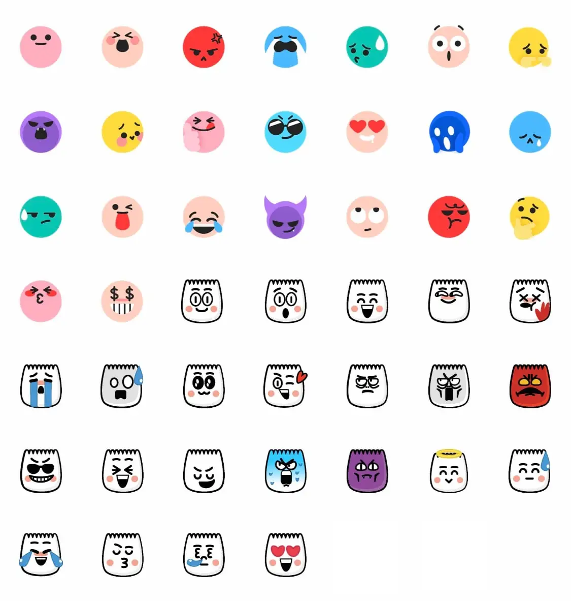

# @tiktok-emojis/vue

> **The complete collection of 46 hidden TikTok emojis, from `[smile]` to `[loveface]`, as lightweight SVG components for Vue 3. Perfect for chats, comments, and social features in any Vue 3 project.**

**Try it online → [TiktokEmojis.click](https://tiktokemojis.click)**



## 🎯 Why @tiktok-emojis/vue?

Transform your Vue 3 applications with TikTok's exclusive hidden emojis! This library provides all 46 secret TikTok emoticons as high-quality, tree-shakable SVG components, bringing the fun and expressiveness of TikTok's unique emoji system to your web projects.

### ✨ Key Features

- 🎨 **Complete TikTok Emoji Collection**: All 46 hidden TikTok emojis included.
- ⚡ **Lightweight & Tree-shakable**: Only bundle the components you use.
- 🔧 **Fully Typed**: Built with TypeScript for excellent developer experience.
- 🌐 **SSR Compatible**: Works seamlessly with Nuxt 3 and other SSR frameworks.
- 📱 **Responsive**: Customizable size with `width`, `height`, and `size` props.
- 🎯 **Vue 3 Only**: Designed specifically for Vue 3 with Composition API support.
- 🚀 **Zero Dependencies**: No external dependencies beyond Vue 3.

## 📦 Installation

```bash
npm install @tiktok-emojis/vue

yarn add @tiktok-emojis/vue

pnpm add @tiktok-emojis/vue
```

## 🚀 Quick Start

```html
<script setup lang="ts">
import { Angel, Happy, Cry, Laugh } from "@tiktok-emojis/vue";
</script>

<template>
  <div>
    <Angel :size="32" />
    <Happy :size="48" />
    <Cry :width="24" :height="24" />
    <Laugh size="6rem" />
  </div>
</template>
```

## 📚 Usage Examples

### Basic Usage

```html
<script setup lang="ts">
import { Smile, Angry, Wow } from "@tiktok-emojis/vue";
</script>

<template>
  <div>
    <!-- Default size (24px) -->
    <Smile />

    <!-- Custom size -->
    <Angry :size="48" />

    <!-- Custom width and height -->
    <Wow :width="32" :height="32" />
  </div>
</template>
```

### Individual Component Import

For optimal bundle size, import components individually:

```html
<script setup lang="ts">
import { Angel } from "@tiktok-emojis/vue/angel";
import { Happy } from "@tiktok-emojis/vue/happy";
import { Cry } from "@tiktok-emojis/vue/cry";
</script>

<template>
  <div>
    <Angel :size="32" />
    <Happy :size="48" />
    <Cry :size="24" />
  </div>
</template>
```

### Dynamic Component Loading

```html
<script setup lang="ts">
import { ref, computed } from "vue";
import * as TikTokEmojis from "@tiktok-emojis/vue";

type ValueOf<T> = T[keyof T];
type Component = ValueOf<typeof TikTokEmojis>;

function resolve(record: Record<string, Component>, code: string) {
  const key = code?.charAt(0).toUpperCase() + code.slice(1);
  const result = record[key];
  return result;
}

const selected = ref("Smile");

const element = computed(() => resolve(TikTokEmojis, selected.value));
</script>

<template>
  <div style="display: flex; justify-content: center; align-items: center;">
    <select v-model="selected">
      <option value="Smile">Smile</option>
      <option value="Happy">Happy</option>
      <option value="Angry">Angry</option>
    </select>
    <div style="margin-left: 50px;">
      <component :is="element" :size="64" />
    </div>
  </div>
</template>
```

## 🎨 Available Components

All 46 TikTok hidden emojis are available as Vue 3 components:

| # |  Component | TikTok Code | Description |
|:-----------|:-------------|:-------------|:--------|
| 1 |  `<Smile />` | `[smile]` | A subtle pink smiley face that conveys gentle happiness and friendliness. |
| 2 |  `<Happy />` | `[happy]` | An exuberant peach-colored face showing pure joy and extreme excitement. |
| 3 |  `<Angry />` | `[angry]` | A red-faced emoji expressing frustration, anger, or strong displeasure. |
| 4 |  `<Cry />` | `[cry]` | A blue face with streaming tears showing deep sadness or emotional overwhelm. |
| 5 |  `<Embarrassed />` | `[embarrassed]` | A blushing face with rosy cheeks showing embarrassment or bashfulness. |
| 6 |  `<Surprised />` | `[surprised]` | Wide-eyed face with open mouth showing shock, surprise, or amazement. |
| 7 |  `<Wronged />` | `[wronged]` | A yellow face with sad eyes and finger-pointing gesture showing feeling wronged or unfairly treated. |
| 8 |  `<Shout />` | `[shout]` | An open-mouthed face expressing loud excitement, cheering, or shouting. |
| 9 |  `<Flushed />` | `[flushed]` | A red-cheeked face showing embarrassment, shyness, or being flustered. |
| 10 |  `<Yummy />` | `[yummy]` | A face with tongue out licking lips, showing something is delicious or desirable. |
| 11 |  `<Complacent />` | `[complacent]` | A self-satisfied face with a smug expression showing complacency or smugness. |
| 12 |  `<Drool />` | `[drool]` | A face with drool showing intense desire, hunger, or craving. |
| 13 |  `<Scream />` | `[scream]` | A face with wide eyes and open mouth showing fear, shock, or distress. |
| 14 |  `<Weep />` | `[weep]` | A tearful face showing deep sadness, grief, or emotional pain. |
| 15 |  `<Speechless />` | `[speechless]` | A face with hand covering mouth showing shock, disbelief, or being at a loss for words. |
| 16 |  `<Funnyface />` | `[funnyface]` | A goofy face with exaggerated features showing silliness and humor. |
| 17 |  `<Laughwithtears />` | `[laughwithtears]` | A face crying tears of laughter showing something is hilariously funny. |
| 18 |  `<Wicked />` | `[wicked]` | A mischievous face with a sly smile showing playful wickedness or scheming. |
| 19 |  `<Facewithrollingeyes />` | `[facewithrollingeyes]` | A face with rolling eyes showing annoyance, sarcasm, or exasperation. |
| 20 |  `<Sulk />` | `[sulk]` | A pouting face showing sulking, disappointment, or being upset. |
| 21 |  `<Thinking />` | `[thinking]` | A thoughtful face with hand on chin showing contemplation or consideration. |
| 22 |  `<Lovely />` | `[lovely]` | A face with heart-shaped eyes showing love, admiration, or being smitten. |
| 23 |  `<Greedy />` | `[greedy]` | A face with a greedy expression showing desire for more or being materialistic. |
| 24 |  `<Wow />` | `[wow]` | An amazed face with wide eyes and open mouth showing wonder or awe. |
| 25 |  `<Joyful />` | `[joyful]` | A radiant face with sparkling eyes showing pure joy and happiness. |
| 26 |  `<Hehe />` | `[hehe]` | A face with a mischievous grin showing playful humor or light teasing. |
| 27 |  `<Slap />` | `[slap]` | A face with raised hand showing frustration or the urge to slap something. |
| 28 |  `<Tears />` | `[tears]` | A face with tears showing sadness, emotional release, or being moved. |
| 29 |  `<Stun />` | `[stun]` | A stunned face showing shock, disbelief, or being completely taken aback. |
| 30 |  `<Cute />` | `[cute]` | A sweet face with an adorable smile showing cuteness or endearment. |
| 31 |  `<Blink />` | `[blink]` | A winking face with one eye closed showing playfulness or shared understanding. |
| 32 |  `<Disdain />` | `[disdain]` | A face with raised eyebrow showing disdain, disapproval, or skepticism. |
| 33 |  `<Astonish />` | `[astonish]` | A face with wide eyes and raised eyebrows showing astonishment or amazement. |
| 34 |  `<Rage />` | `[rage]` | A face with an extremely angry expression showing intense rage or fury. |
| 35 |  `<Cool />` | `[cool]` | A face wearing sunglasses showing coolness, confidence, or being unfazed. |
| 36 |  `<Excited />` | `[excited]` | A face with sparkling eyes and big smile showing excitement and anticipation. |
| 37 |  `<Proud />` | `[proud]` | A face with a proud expression showing satisfaction with an achievement. |
| 38 |  `<Smileface />` | `[smileface]` | A face with a big, warm smile showing happiness and friendliness. |
| 39 |  `<Evil />` | `[evil]` | A face with a devilish grin showing mischief, plotting, or playful evil. |
| 40 |  `<Angel />` | `[angel]` | A face with a halo showing innocence, purity, or pretending to be good. |
| 41 |  `<Laugh />` | `[laugh]` | A face laughing heartily showing joy, amusement, or finding something funny. |
| 42 |  `<Pride />` | `[pride]` | A face showing pride and self-satisfaction with achievements or qualities. |
| 43 |  `<Nap />` | `[nap]` | A sleepy face with closed eyes showing tiredness or desire to sleep. |
| 44 |  `<Loveface />` | `[loveface]` | A face with heart-shaped eyes showing love, infatuation, or being smitten. |
| 45 |  `<Awkward />` | `[awkward]` | A face with a nervous smile showing awkwardness, discomfort, or social unease. |
| 46 |  `<Shock />` | `[shock]` | A face with a shocked expression showing surprise, disbelief, or being stunned. |

## 🔧 Component Props

All TikTok emoji components accept the following props:

```tsx
interface TikTokEmojiProps {
  width?: string | number;   // Custom width
  height?: string | number;  // Custom height
  size?: string | number;    // Sets both width and height
}
```

### Examples

```html
<template>
  <!-- Using size prop (recommended) -->
  <Smile :size="32" />
  <Happy size="2rem" />

  <!-- Using width and height individually -->
  <Cry :width="24" :height="24" />
  <Laugh width="1.5em" height="1.5em" />

  <!-- Default size (24px) if no props provided -->
  <Angel />
</template>
```

## 🌐 SSR Support

`@tiktok-emojis/vue` is fully compatible with Server-Side Rendering frameworks:

### Nuxt 3

```html
<script setup lang="ts">
import { Angel, Happy } from "@tiktok-emojis/vue";
</script>

<template>
  <div>
    <h1>Welcome to my app!</h1>
    <Angel :size="48" />
    <Happy :size="32" />
  </div>
</template>
```

## 🎯 Best Practices

### Performance Optimization

1. **Use individual imports** for better tree-shaking:
```html
<script setup lang="ts">
// ✅ Good: only imports what you need
import { Smile } from "@tiktok-emojis/vue/smile";

// ❌ Avoid: imports the entire library
import { Smile } from "@tiktok-emojis/vue";
</script>
```

2. **Lazy load components** for better performance:
```html
<script setup lang="ts">
import { defineAsyncComponent } from 'vue'

const Smile = defineAsyncComponent(() => import("@tiktok-emojis/vue/smile"))
</script>

<template>
  <Suspense>
    <template #default>
      <Smile :size="32" />
    </template>
    <template #fallback>
      Loading...
    </template>
  </Suspense>
</template>
```

## 🔧 TypeScript Support

This library is built with TypeScript and provides full type safety:

```html
<script setup lang="ts">
import { Angel, Happy } from "@tiktok-emojis/vue";
</script>

<template>
  <div>
    <Angel :size="32" />      <!-- ✅ Valid -->
    <Happy size="2rem" />     <!-- ✅ Valid -->
    <Angel size="invalid" />  <!-- ❌ Error -->
  </div>
</template>
```

## 📋 Requirements

- Vue >=3.0.0
- TypeScript 4.0+ (optional, but recommended)

## 📄 License

MIT.

## 🚀 Related Packages

- **[@tiktok-emojis/react](https://www.npmjs.com/package/@tiktok-emojis/react)**: React version.

## 🌟 Community & Support

- 📖 **Documentation**: [https://tiktokemojis.click/docs/vue](https://tiktokemojis.click/docs/vue)
- 🌐 **Official Website**: [https://tiktokemojis.click](https://tiktokemojis.click)
- 🐛 **Report Issues**: [https://github.com/boqingren/tiktok-emojis/issues](https://github.com/boqingren/tiktok-emojis/issues)

## ⚠️ Disclaimer

This project is created by TikTok fans for the purpose of showcasing the 46 hidden TikTok emojis in Vue 3 applications.
We only provide the original emoji images converted to SVG components; no additional information or assets are distributed.
All TikTok emoji images remain the property of TikTok.
This project and the website [TiktokEmojis.click](https://tiktokemojis.click) are not affiliated with, endorsed by, or officially associated with the TikTok app or ByteDance Corporation.

**Made with ❤️ for the Vue 3 community**

Transform your Vue 3 applications with TikTok's exclusive emoji collection. Visit [TiktokEmojis.click](https://tiktokemojis.click) for live demos, interactive examples, and comprehensive documentation.

*Keywords: TikTok emojis, TikTok hidden emojis, TikTok secret emojis, Vue 3 components, TikTok emoticons, TikTok sticker components, SVG components, TikTok emoji SVG, Vue emoji library, TikTok emoji codes*
